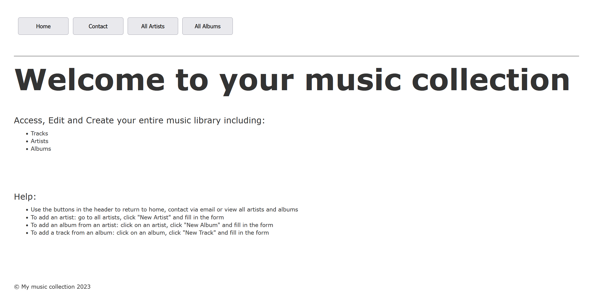

# Music Collection App
## Table of contents
* [General info](#general-info)
* [Technologies](#technologies)
* [Setup](#initial-setup)
* [Website](#accessing-the-website)
* [Running tests](#running-tests)
* [Seeds](#seeding-the-database)

## General Info
This project is an example of using the ruby on rails framework to store and retrieve data in a relational database.

## Technologies
* Ruby 2.5.1
* Rails 13.0.1
* Sqlite3 3.16.2

## Initial Setup
### Creating the image
This command will build the docker image, and then run it in a container, and a rails server will be hosted on localhost:3000:
```bash
docker-compose up --build 
```
### Shutting down the container
This command will close and remove any docker images that are running in the current directory:
```bash
docker-compose down
```
### Running bash on rails container
After the command finishes running open other terminal window and run the following command to open bash inside the container:
```bash
docker exec -it music_collection_app_web_1 /bin/bash -il
```
### Accessing the database from inside the rails container
To access the database from the rails container you must first access the rails container using the [command](#running-bash-on-rails-container) above, then type:
```bash
rails db
```
This project uses sqlite3 to manage the database.

## Accessing the website
Once the docker container is fully up and running the webserver should be hosted on locally on port ```3000```.
```
localhost:3000
```
The website contains four views: "Home", "Contact", "All Artists, "All Albums".



## Running tests
All tests are held in the test directory which includes tests for the controllers, models, and the mailer along with fixtures (sample data). To run the test suite, access the bash of the rails container using the [command](#running-bash-on-rails-container) above. Then run:
```bash
rails test
```
The output should look similar to below:
```
root@6f5a2a946028:/app# rails test
2023-04-17 23:19:29 WARN Selenium [DEPRECATION] Selenium::WebDriver::Chrome#driver_path= is deprecated. Use Selenium::WebDriver::Chrome::Service#driver_path= instead.
Running via Spring preloader in process 80
Run options: --seed 23557

# Running:

..................................

Finished in 4.055997s, 8.3826 runs/s, 12.8205 assertions/s.
34 runs, 52 assertions, 0 failures, 0 errors, 0 skips      
root@6f5a2a946028:/app# 
```

## Seeding the database
By default the database is seeded with two artists, four albums (2 each), and eight tracks (2 on each album). To start with a clean database you can either edit the entrypoint file and disable rails seeding or enter the bash terminal and clear the database in sqlite after the container has been started.

### Editing the entrypoint
This command resets the database by dropping, creating, and then migrating any structure changes and should be left alone to properly setup the db structure. The comment show that this command is equivalent to three smaller ones executed in order.
```bash
rails db:migrate:reset      #[db:migrate:reset] => [db:drop]-[db:create]-[db:migrate]
```
This command loads the schema and then seeds the database, the comment shows the equivalent smaller commands. To remove the seed loading change ```db:setup``` to ```db:schema:load```.
```bash
rails db:setup              #[db:setup] => [db:schema:load]-[db:seed]
```
The code below is what the entrypoint should look like.
```bash
rails db:schema:load        #Does not seed db
```

### Changing the seeds
The database seeds are in the "\db" directory, you can copy the format of the data already there or look to the ruby on rails documentation for more information. This example creates one artist with one album and one track:
```ruby
newArtist = Artist.create({
    :name => "Mark"
})
newArtist.albums.create({
    :title => "MyAlbum",
    :genre => "Pop",
    :artist_id => artist1.id
})
newArtist.albums.last.tracks.create({
    :name => "MyTrack",
    :length => "2:30",
    :genre => "Pop",
    :release_date => "18/04/2023",
    :album_id => artist1.albums.last.id,
    :artist_id => artist1.id
})

```

## Troubleshooting
### "A server is already running. Check /app/tmp/pids/server.pid."
If this error occurs navigate to the file stated, the files should be a single number "1", change this to a "0" and restart the docker container.